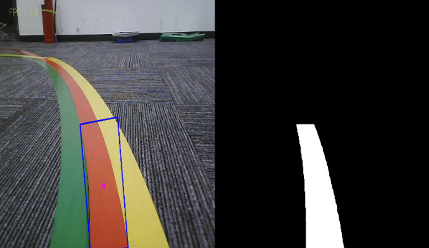

# FollowLine_Lidar_ROS2

在巡线代码中添加了雷达避障模块，当雷达判断前方有障碍时停车；同时，不是根据某一种颜色来进行选择追随，在程序开始后可以选择哪个颜色进行过滤，亚博智能的代码无法追随纯黑色，这里进行了更新和改进

## 如何使用这份代码
```bash
$ colcon build
$ . install/setup.bash
$ ros2 run Follow_line_withlidar_ros2 follow_line_lidar
```

键盘按键控制：

【r】：选色模式，可用鼠标选择要识别的颜色的区域（不能超过区域范围）。

【i】：目标检测模式。左侧彩色图（Color），右侧二值图（Binary）。

【q】：退出程序。

【空格键】：循迹行驶。

<p align="center">
  
</p>
